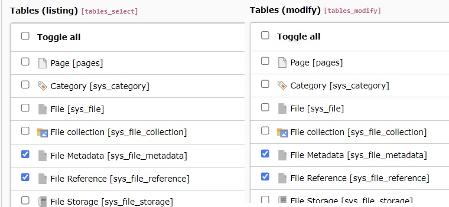
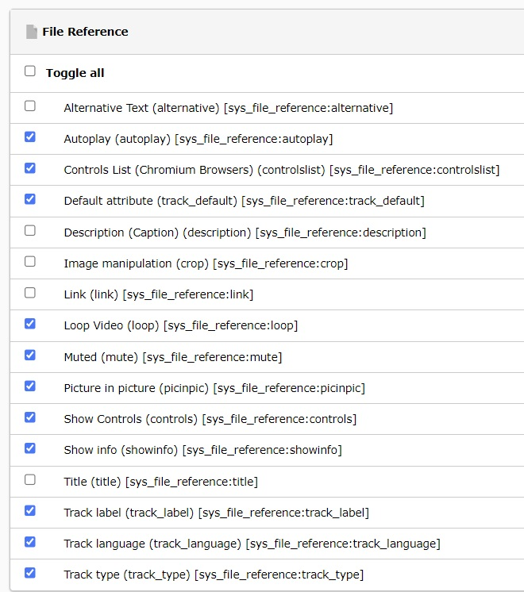

.. _backend-user-settings:

=============
Backend user settings
=============

Each setting that is described in the :ref:`Editors manual <user-manual>` is configured as an exclude field.

That means each field has to be specifically allowed for the editor user or user group.

Switch to the :guilabel:`Backend Users > Backend user groups` module

Edit the user group and switch to the `Access Rights` tab._backend

To add and change tracks and time-based data, the group must be allowed to list and modify the `File Metadata` table.

To add and change poster images as well as change the video controls, the group must be allowed to list and modify the `File Reference` table.

   Allow the File Metadata and File Reference tables

In the `Allowed excludefields` section of the same group

1) go to the `File Metadata` table and allow the following fields:

- Poster Image (poster) [sys_file_metadata:poster]
- Text Tracks and Time-based Data (tracks) [sys_file_metadata:tracks]

2) go to the `File Reference` table and allow the following fields:

   - Video Controls:
      - Loop Video (loop) [sys_file_reference:loop]
      - Muted (mute) [sys_file_reference:mute]
      - Show Controls (controls) [sys_file_reference:controls]
      - Show info (showinfo) [sys_file_reference:showinfo]
      - Picture in picture (picinpic) [sys_file_reference:picinpic]
      - Controls List (Chromium Browsers) (controlslist) [sys_file_reference:controlslist]
   - Poster Image:
      - Poster Image (Override Poster from Metadata) (poster) [sys_file_reference:poster]
   - Tracks and time-based data:
      - Default attribute (track_default) [sys_file_reference:track_default]
      - Track label (track_label) [sys_file_reference:track_label]
      - Track language (track_language) [sys_file_reference:track_language]
      - Track type (track_type) [sys_file_reference:track_type]

   Allow the fields for the `File Reference` table

.. note::
   See :ref:`Backend user permissions <permissions>` for more information.

.. _permissions: https://docs.typo3.org/permalink/t3coreapi:setting-up-user-permissions
