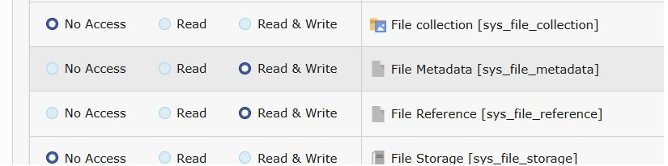
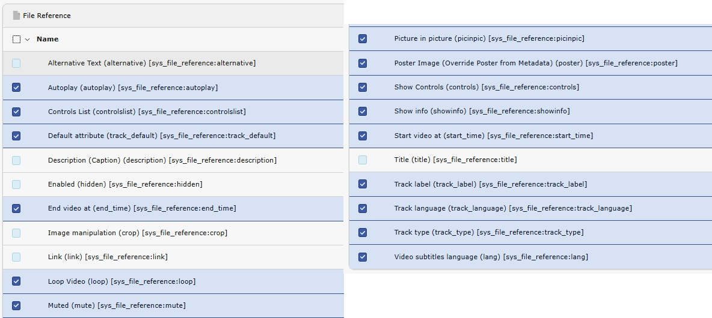

.. _backend-user-settings:

Backend user settings
===

All settings described in the :ref:`Editors manual <user-manual>` are configured as exclude fields.

This means each field must be explicitly allowed for the editor user or user group.

.. note::
   See :ref:`Backend user permissions <permissions>` and :ref:`Allowed exclude fields <allowedFields>` for more information.

Allow text-tracks and video controls
---

Switch to the :guilabel:`Backend Users > Backend user groups` module

Edit the appropriate user group and switch to the :guilabel:`Access Rights` tab.

.. important::
   To add or modify tracks and time-based data, the group must have permission to list (read) and modify (write) the `File Metadata` table.

   To add or modify poster images and video controls, the group must have permission to list (read) and modify (write)  the `File Reference` table.

   See :ref:`Table permissions <tablePermissions>` for more information.

   Allow the File Metadata and File Reference tables

In the `Allowed excludefields` section of the same group, follow these steps to enable the necessary fields:

1) Go to the `File Metadata` table. Here, the administrator decides which fields the editor is allowed to see and use. Allow the following fields::

- Poster Image (poster) [sys_file_metadata:poster]
- Text Tracks and Time-based Data (tracks) [sys_file_metadata:tracks]

2) Go to the `File Reference` table. The administrator determines which fields are accessible to the editor. Allow the following fields:

   - Video Controls:
      - Loop Video (loop) [sys_file_reference:loop]
      - Muted (mute) [sys_file_reference:mute]
      - Show Controls (controls) [sys_file_reference:controls]
      - Show info (showinfo) [sys_file_reference:showinfo]
      - Picture in picture (picinpic) [sys_file_reference:picinpic]
      - Controls List (Chromium Browsers) (controlslist) [sys_file_reference:controlslist]
      - Start video at (start_time)
      - End video at (end_time)
      - Video subtitles language (lang)
   - Poster Image:
      - Poster Image (Override Poster from Metadata) (poster) [sys_file_reference:poster]
   - Tracks and time-based data:
      - Default attribute (track_default) [sys_file_reference:track_default]
      - Track label (track_label) [sys_file_reference:track_label]
      - Track language (track_language) [sys_file_reference:track_language]
      - Track type (track_type) [sys_file_reference:track_type]

   Allow the applicable fields for the `File Reference` table

.. _permissions: https://docs.typo3.org/permalink/t3coreapi:setting-up-user-permissions
.. _allowedFields: https://docs.typo3.org/permalink/t3coreapi:access-lists-allowed-excludefields
.. _tablePermissions: https://docs.typo3.org/permalink/t3coreapi:access-lists-tables
