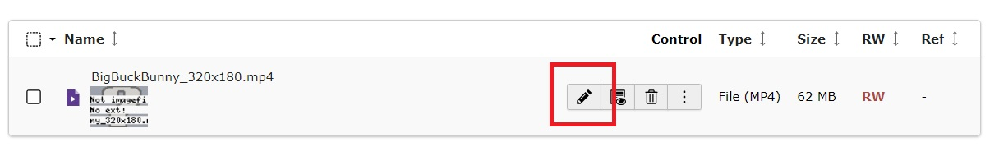
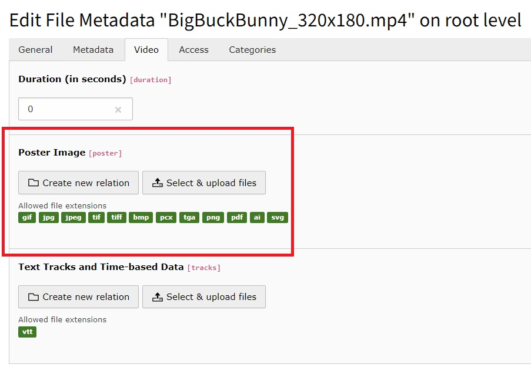
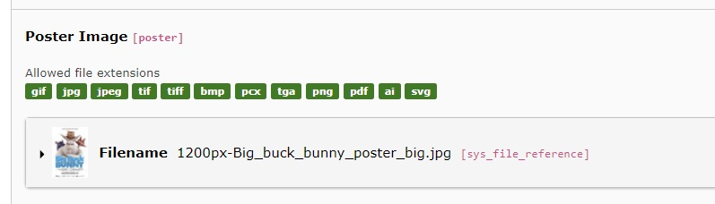
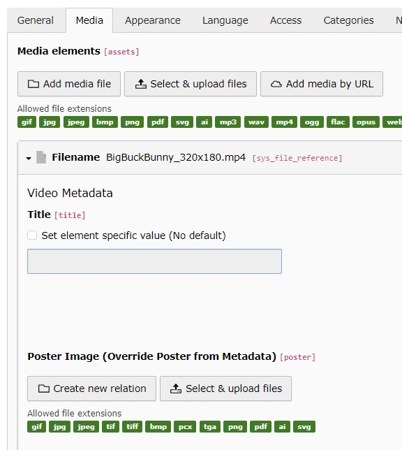
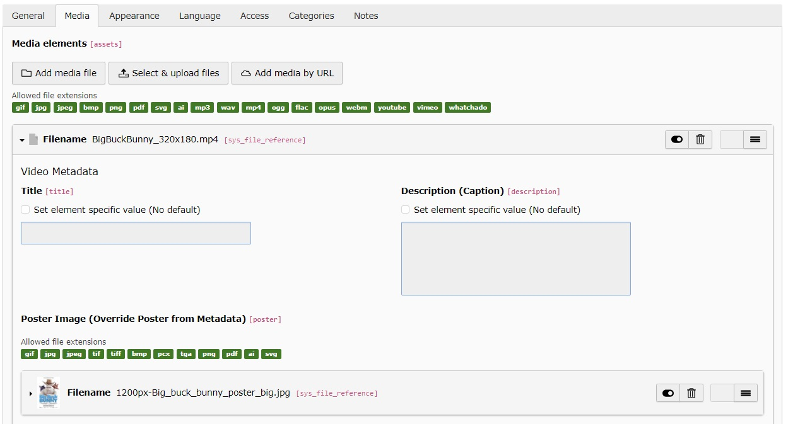

.. _poster-image:

Poster Image
===

For self-hosted videos, e.g. mp4 you can add a poster image that is added to the video.

You can set a poster image either in the video's metadata or in the file reference of the content element where the video is used.

.. tip::
   When referencing the same video in multiple places on your website, it is recommended to :ref:`add the poster image to the video's metadata <poster-image-metadata>`. This way, you only need to add it once.

   A :ref:`poster image in the file reference <poster-image-reference>` takes precedence over the metadata poster image.
   You can use that when you want to have different poster images for the same video.

.. _poster-image-metadata:

Add poster image in file metadata
---

Switch to the module :guilabel:`File > Filelist`.

Select the video where you want to add the poster image and edit the metadata of the file

   Click the pencil button to edit the video's metadata

Switch to the :guilabel:`Video` tab and add or upload an image for the `Poster image` field

   Add an existing or upload a new image file, that should be used as the video's poster image

   When the image has been added, click `Save`

.. _poster-image-reference:

Add poster image in file references
---

For example in a textmedia element.

Add your video. In the video file reference you can now add your poster image

   Add an existing or upload a new image file, that should be used as the video's poster image

   When the image has been added, click `Save`

