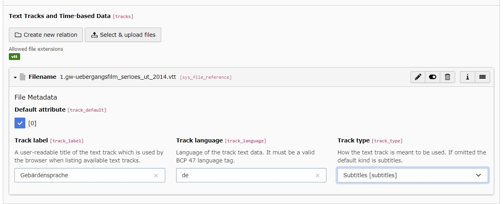
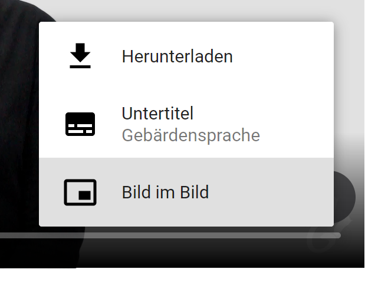

.. _text-tracks:

Text tracks and time-based data
===

Switch to the module :guilabel:`File > Filelist`.

Select the video you want to add the VTT file to, then edit its metadata

Switch to the :guilabel:`Video` tab, then add or upload one or more VTT files.

   Add VTT file(s) to a self-hosted video in the backend

.. note::
   After adding a VTT file, save the metadata once to see the additional fields.

Available text track fields
---

:Track label: A user-readable title of the text track which is used by the browser when listing available text tracks.

:Track language: Language of the track text data. It must be a valid BCP 47 language tag. (e.g. de, en, etc.)

:Track type: How the text track is meant to be used. (subtitles, captions, chapters, etc.)

:Default attribute: When active, adds the 'default' attribute to the rendered track.

.. tip::

   Adding a default track is useful if you want subtitles to be enabled automatically.

.. important::

   When adding multiple tracks, set the default attribute for only one track.

   Example frontend rendering in the default video player
