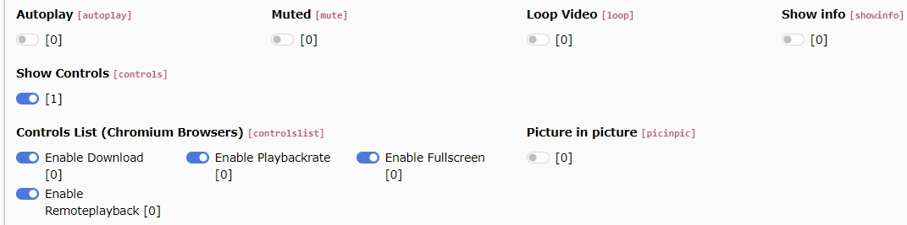

.. _video-controls:

Video controls
==========================

For YouTube, Vimeo and self-hosted videos you can set certain attributes which are added to the video tag in the frontend.

   Available control switches in a video file reference

.. tip::

   When enabling autoplay for a video, the video is automatically set to muted.

.. _video-controls-list:

List of available video controls
==========================
The following options allow you to customize the behavior and appearance of your videos. Each control may apply to different video sources—YouTube, Vimeo, or self-hosted video files. Check the notes for which types each option affects.

:Autoplay: Automatically play the video when the website is loaded.
Applies to: YouTube, Vimeo, MP4

:Muted: Mute the video.
Applies to: YouTube, Vimeo, MP4

:Loop Video: Automatically restart the video when it’s finished playing.
Applies to: YouTube, Vimeo, MP4

:Show info: Show YouTube-specific information like the video title or uploader before playback begins.
Applies to: YouTube only

:Show Controls: Display the player’s controls (play button, time track, etc.).
Applies to: YouTube, Vimeo, MP4

:Controls List (Chromium Browsers): Additional controls available in Chromium browsers (Google Chrome, MS Edge, etc.). Requires Show Controls to be enabled.

YouTube & Vimeo: Fullscreen only

Self-hosted videos: Fullscreen, Enable Download, Enable Playback Rate, Enable Remote Playback

:Picture in Picture: Add picture-in-picture mode for the video.
Applies to: self-hosted videos only

:Start video at: Begin playback at a specific point in the video instead of starting from the beginning. Enter the time in seconds.
Applies to: YouTube, Vimeo, self-hosted videos

:End video at: Stop playback at a specific point in the video rather than playing until the end. Enter the time in seconds.
Applies to: YouTube, Vimeo, self-hosted videos

:Video subtitles language: Select the language for the YouTube subtitles. Only languages available for the current video will be applied. When set, subtitles are automatically loaded and displayed in the chosen language.
Applies to: YouTube only
