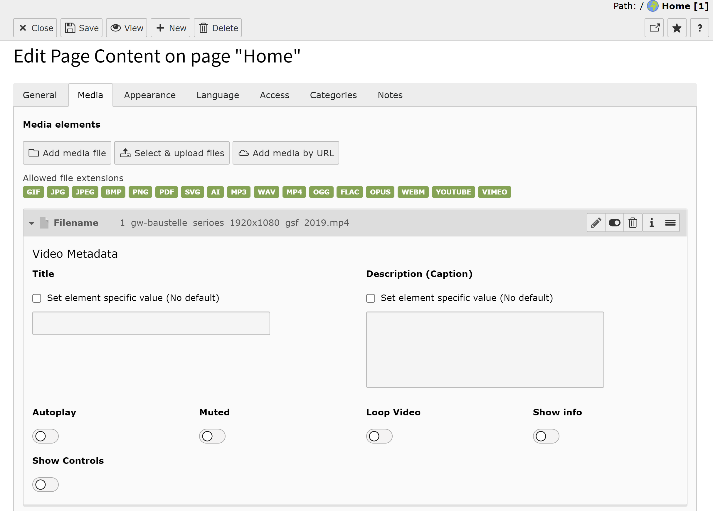
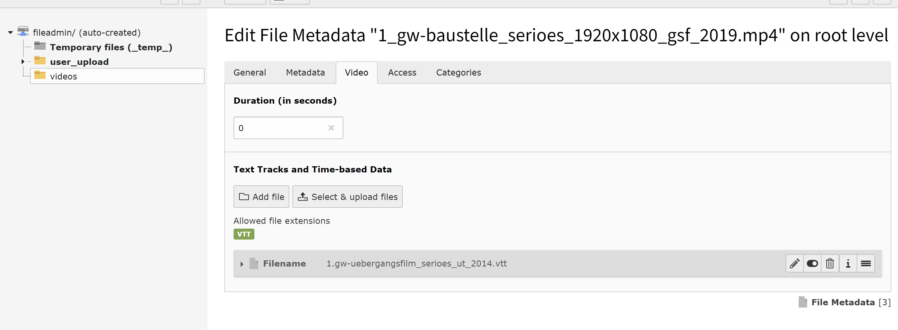
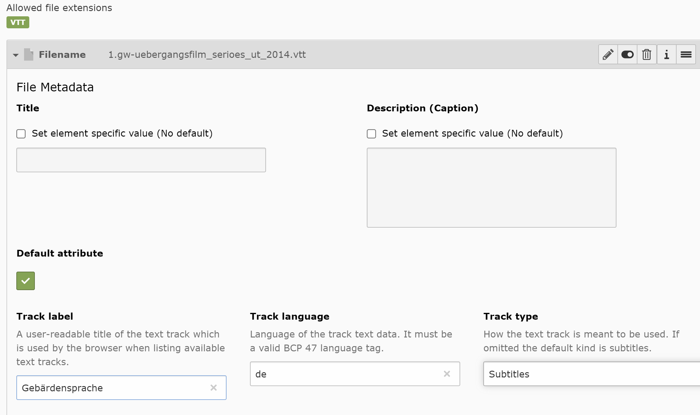

.. include:: ../Includes.txt

.. _introduction:

============
Introduction
============

.. _what-it-does:

What does it do?
================

Video VTT extends the file metadata of video files.
You can add text tracks and time-based Data.
(see https://developer.mozilla.org/en-US/docs/Web/API/WebVTT_API )

Additionally, the extension adds options to mute/ loop/ etc. videos (local, youtube, vimeo)

.. _configuration:

=============
Configuration
=============

After installation, no additional configuration is needed.

.. _screenshots:

Screenshots
===========

   Video control switches in Video Metadata

   Add VTT file(s) to local video

   Metadata Attributes added by EXT:video_vtt

